# OOPU2 (Studentų surašymo ir skirstymo programa) - v1.1
Studentų pažymių surašymo (ranka, automatiškai sugeneruojamų arba iš failo) bei vidurkių skaičiavimo ir studentų
kategorizacijos į dvi grupes programa  

# 🛠️ Projekto kompiliavimo instrukcijos
1. Atsiųsti [g++ kompiliatorių](https://sourceforge.net/projects/mingw-w64/)
2. Atsisiųsti [CMake (Bent v. 3.29)](https://cmake.org/download/)
3. [Klonuoti šio projekto direktoriją](https://docs.github.com/en/repositories/creating-and-managing-repositories/cloning-a-repository)
4. Atsidaryti komandinę eilutę (cmd arba powershell) ir į ją įvesti   `cmake -B build -S . ; cmake --build build`
5. Eiti į naujai sukurtą /build/ direktoriją ir joje paleisti <strong>OOPUžduotis1.exe</strong> :)

# Projekto naudojimosi instrukcijos
Įjungus programą turėtumete matyti meniu su galimais pasirinkimais:
1. Studentus ir pazymius ivesti ranka - Leidžia studentų vardus ir pažymius įvesti ranka
2. Generuoti pazymius, bet studentus ivesti ranka - Automatiškai sugeneruoja pažymius jūsų įvestiems studentams
3. Generuoti pazymius ir studentus - Automatiškai sugeneruoja nuo 1 iki 10 studentų ir jų pažymių
4. Ivesti pazymius is failo, siuo metu pasirinktas failas: ... - Leidžia naudotis programą su 5 punkte pasirinktu failu
5. Pasirinkti ivesties faila - leidžia pasirinkti įvesties failą iš visų galimų data/input direktorijoje
6. Generuoti faila - sugeneruoja jūsų norimo dydžio pavyzdinį studentų failą
7. Testavimo rezimas - programos spartumo testavimas
8. Baigti programos darba

### Jeigu norite įkelti savo failą programos 4. ir 5. punktams, tai galima padaryti įkėlus atitinkamą failą į projekto data/input/ direktoriją.  

Testuojant programos spartą:
1. Failu kurimo greiti
2. Failu nuskaitymo greiti (su senos versijos testiniais failais) - būtina turėti testavimo failus.
3. Failu nuskaitymo, rusiavimo, kategorizavimo ir isvesties greiti - būtina pirma sugeneruoti failus su 1. punktu.
Greitis gali priklausyti nuo sugeneruotų failų pažymių kiekio.

-----------------------------
## Programos testavimo kompiuterio specifikacijos
| Komponentas | Specifikacija           |
|-------------|-------------------------|
| CPU         | Intel i7-13700H 2.40GHz |
| RAM         | 16 GB DDR5              |
| HDD         | SSD                     |

# V1.1 Testavimai (Nauji)
(Greiciai pateikiami kaip 3 testu vidurkis)  
(Nesuprantu kodel failo dydis mazeja lol.)  

| Kompiliavimo vėliava | Greitis 100000 (Struct) | Greitis 1000000 (Struct) | Exe dydis(Struct) | Greitis 100000 (Class) | Greitis 1000000 (Class) | Exe dydis (Class) |
|----------------------|-------------------------|--------------------------|-------------------|------------------------|-------------------------|-------------------|
| Jokios               | 1.32934s                | 14.872s                  | 998 KB            | 1.54536s               | 17.443s                 | 505 KB            |
| O1                   | 0.91309s                | 6.2466s                  | 347 KB            | 0.65874s               | 7.4615s                 | 239 KB            |
| O2                   | 0.53205s                | 6.5285s                  | 329 KB            | 0.63472s               | 7.4984s                 | 258 KB            |
| O3                   | 0.53682s                | 6.4576s                  | 262 KB            | 0.64214s               | 7.3300s                 | 290 KB            |

# V1.0 Testavimai (Seni)

# Strategiju testavimo rezultatai
(Testai daryti be -O3. Programos naudojimo metu rezultatai bus greitesni.)

## Strategija 1
### Su Vector
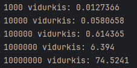
### Su List
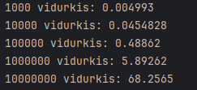
### Su Deque
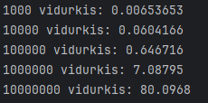
 

## Strategija 2
(Patobulinta versija)
### Su Vector
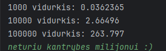
### Su List
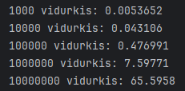
### Su Deque
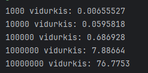
 

## Strategija 3
Pagal strategija 2 naudojant std::stable_partition
### Su Vector
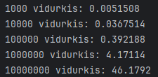
### Su List
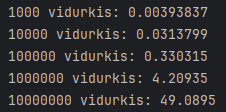
### Su Deque
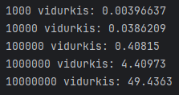
 

-------------------------
# Programos testavimo rezultatai pradiniam release:
Testuojama tik failo nuskaitymas, įrašų rūšiavimas bei kategorizavimas. Pateikiamas trijų testų vidurkis.  
Visi failai turi po 5 ND pažymius.
### Testavimas su vector:
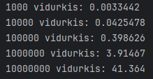

### Testavimas su list:
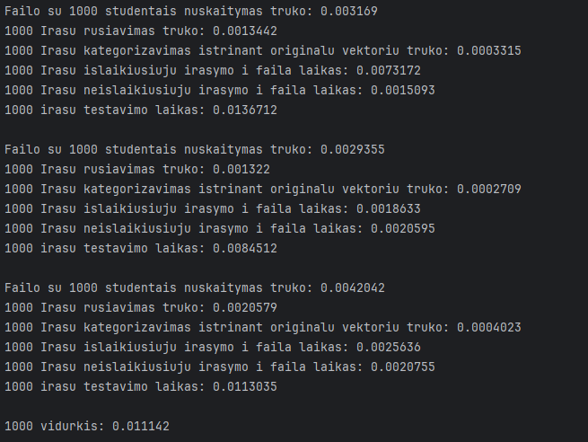

### Testavimas su deque:
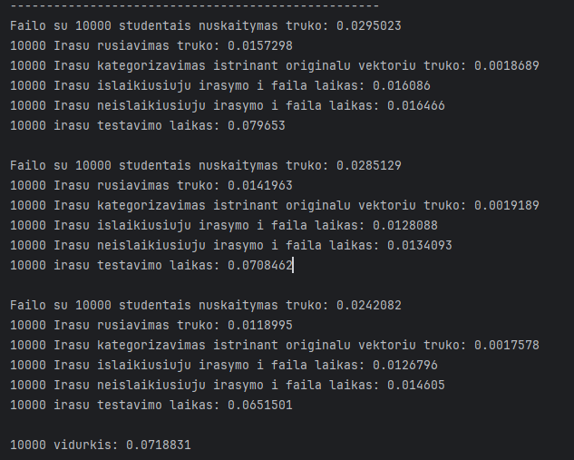** 